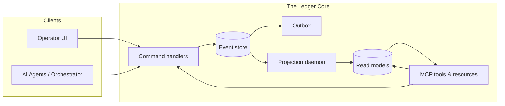
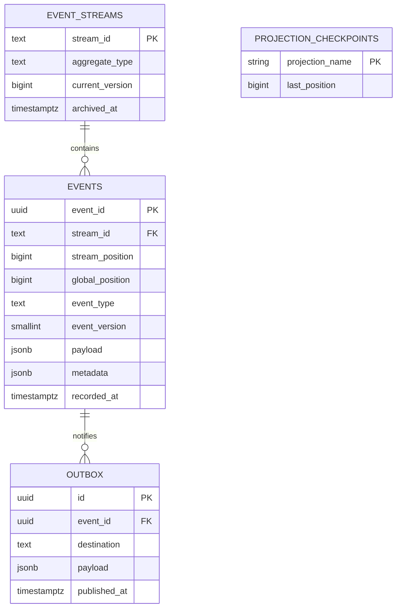
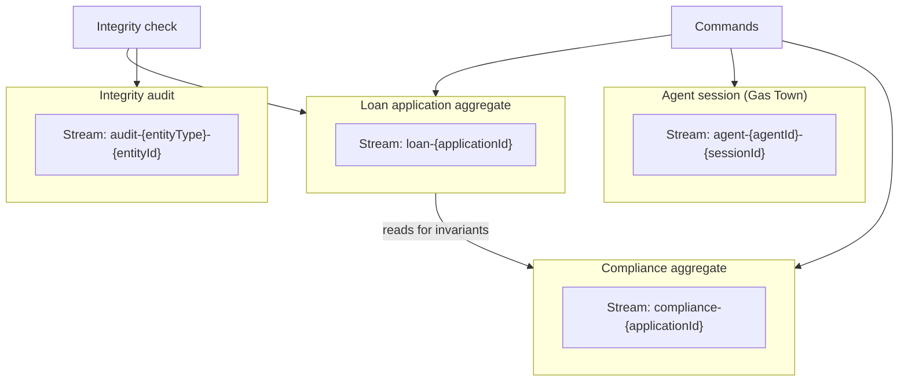
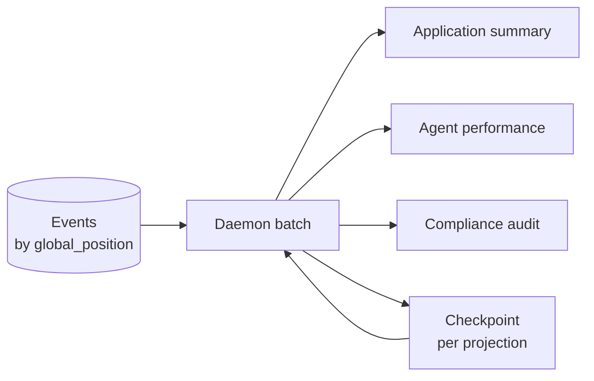
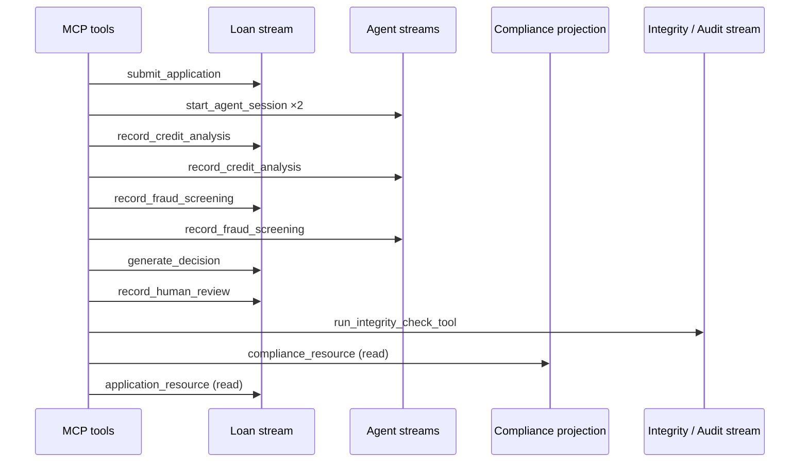

# The Ledger — Final Technical Report

**Apex Financial Services · Event-Sourced Loan Intelligence & Audit Infrastructure**

**Author:** [Your name]  
**Date:** March 2025  
**Version:** 1.0

---

## Executive Summary

This report describes **The Ledger**, an append-only event store and governance layer for AI-assisted loan processing. The system separates authoritative writes (immutable facts in PostgreSQL) from query-optimized read models (CQRS projections), enforces optimistic concurrency for multi-writer safety, supports schema evolution via read-time upcasting, and exposes a Model Context Protocol (MCP) surface for tool-driven automation and audit. The following sections synthesize domain reasoning, architectural tradeoffs, system structure, verification evidence, an end-to-end automation trace, and honest limitations.

---

## 1. Domain Conceptual Reasoning

### 1.1 Event-driven architecture versus event sourcing

**Event-driven architecture (EDA)** treats events primarily as *messages*: components publish and subscribe, often with at-least-once delivery and no guarantee that a message is the durable source of truth. Traces, callbacks, and side-channel logs are typical of EDA; if they are lost, the authoritative state may still exist elsewhere (for example in a mutable CRUD database).

**Event sourcing (ES)** treats the *append-only sequence of domain events* as the **system of record**. Business facts are recorded as immutable events with stable ordering; current state is derived by replay (or by reading projections that are provably equivalent to replay). What changes in a redesign is not “we also log events” but “success of an operation is defined by durable append to the store in a transactional boundary,” together with stream identity, monotonic positions, and explicit concurrency rules.

**Tradeoff:** EDA optimizes for loose coupling and throughput of notifications; ES optimizes for auditability, replay, and temporal reasoning at the cost of write-path discipline and eventual consistency on read models.

### 1.2 Aggregate boundaries

The solution partitions the problem into **LoanApplication**, **AgentSession**, **ComplianceRecord**, and **AuditLedger**-style streams (each with its own stream identity). A plausible alternative—merging compliance events into the loan stream—was rejected because independent writers (compliance batches, orchestrator, human review) would contend on a **single version counter**, producing **false optimistic conflicts** unrelated to business semantics.

Separating **compliance** into `compliance-{application_id}` and **loan lifecycle** into `loan-{application_id}` removes that coupling. Invariants such as “do not approve until compliance is clear” are enforced by **reading** compliance-derived state during validation while **writes** remain on distinct streams.

### 1.3 Concurrency

Concurrent writers use **optimistic concurrency control**: each append specifies an **expected version**; the store locks the stream row, compares the stored cursor, and commits only if they match. One writer succeeds; others receive a typed conflict with **actual** versus **expected** version and must **reload, reconcile, and retry**. This avoids pessimistic locks for the whole workflow while guaranteeing that no silent merge corruption occurs.

### 1.4 Projection lag and user-visible consistency

Read models are **eventually consistent** with the event log. A typical consequence: immediately after a write, a query against a projection may return a value computed before the projector has consumed the latest `global_position`. Responsible UX does not pretend otherwise: responses can carry **lag hints** (events behind head, or time since last processed event) so interfaces can show staleness, poll, or offer a stronger read where product policy warrants it.

### 1.5 Upcasting

When event payloads evolve, old rows remain immutable. **Upcasting** applies version migrations **at read time**, producing in-memory structures compatible with current domain expectations without rewriting history. Unknown attributes from the past are represented deliberately (for example **null** when information truly did not exist), avoiding pretend precision.

### 1.6 Cryptographic audit chains

Beyond append-only storage, a **hash chain** over sealed checkpoints ties a primary entity stream to an **audit stream** of integrity runs. Recomputation detects tampering with historical payloads; failed verification blocks new seals until the inconsistency is resolved. This complements database access controls with a **detectable integrity** story for regulators and internal audit.

---

## 2. Architectural Tradeoff Analysis

| Decision | Rationale | Alternatives considered |
|----------|-------------|-------------------------|
| **PostgreSQL + relational schema** | Mature transactions, constraints, indexing, and advisory locks for projector coordination. | Dedicated event-store products (operational cost); pure log files (weak query and integrity story). |
| **Per-stream optimistic locking** | Scales writer autonomy without long-held locks. | Pessimistic locking (simpler mentally, worse throughput and failure modes). |
| **Transactional outbox** | Same commit as events ensures downstream publish does not acknowledge facts that are not yet durable. | Dual writes to bus and DB (classic inconsistency risk). |
| **CQRS projections** | Fast dashboards and MCP resources without scanning full history on every query. | Read-your-writes only from replay (correct but expensive at scale). |
| **Read-time upcasting** | No destructive migration of historical JSON; replay stays faithful to what was recorded. | Eager migration jobs (batch complexity; risk of partial failure). |
| **Advisory locks per projection** | Cheap way to reduce double-application of events when multiple workers exist. | Single projector process only (availability bottleneck); external lock service (more moving parts). |
| **MCP as automation boundary** | Tools encapsulate validation and append; resources expose projections for LLM-friendly reads. | Direct REST only (less standardized for agent ecosystems). |

**Performance posture:** Write throughput is bounded by transactional appends per stream; read throughput scales with projection tables and indexes. Under burst load, **projection lag** is the main observable tension: the system favors **clear lag metrics and rebuild paths** over pretending that reads are always instantaneous.

---

## 3. System Architecture (Diagrams)

### 3.1 High-level context



### 3.2 Event store schema (conceptual entity relationship)



### 3.3 Aggregate boundaries and stream naming



### 3.4 Command flow and optimistic append

```mermaid
sequenceDiagram
    participant H as Handler
    participant A as Aggregate
    participant S as Event store
    participant O as Outbox

    H->>A: load(stream)
    A-->>H: version + state
    H->>A: validate business rules
    H->>S: append(expectedVersion, events)
    S->>S: BEGIN; lock stream row
    alt version matches
        S->>S: insert events; bump version
        S->>O: insert outbox rows
        S->>S: COMMIT
        S-->>H: success
    else version mismatch
        S->>S: ROLLBACK
        S-->>H: optimistic conflict
    end
```

### 3.5 Projection pipeline and lag



---

## 4. Test Evidence and Service-Level Observations

### 4.1 Double-decision (optimistic concurrency)

**Evidence:** Automated test `tests/test_concurrency.py` exercises two concurrent appends against the same stream with identical expected versions. **Exactly one** append commits; the other receives **`OptimisticConcurrencyError`** with **expected** and **actual** version fields, demonstrating non-destructive conflict signaling rather than silent overwrite.

**Interpretation:** This is the core safety property for multi-agent or multi-tab scenarios: the log remains linearizable per stream while allowing contention to surface as retriable failures.

### 4.2 Projection behavior under load

**Evidence:** `tests/phase3/test_projection_load_slo.py` issues a burst of concurrent application submissions via a **connection pool** (isolating concurrent writes from a single shared client), then drives the projection daemon until **all projection lag indicators reach zero**, asserts **rebuilt read model row counts** match the ingested applications, and bounds **elapsed time** for catch-up and rebuild.

**Interpretation:** The service-level story is not “zero latency” but **bounded catch-up** and **recoverability**: after a burst, the system converges; after a **rebuild-from-scratch** (truncate projections, reset checkpoints, replay), the same derived counts reappear—evidence that projections are **pure functions of the log** modulo operational ordering.

### 4.3 Integrity and upcasting immutability

**Evidence:** Audit tests verify hash-chain verification and tamper detection; upcasting tests compare **canonical JSON fingerprints** and **raw `payload::text`** before and after loads to prove the database row is untouched while in-memory views upgrade schema version.

**Interpretation:** SLOs for integrity are **binary** (chain valid or not) rather than millisecond-based; performance SLOs apply to projection convergence and operational rebuild windows.

---

## 5. MCP Automation Trace (Loan Path)

The following trace is executed by **`tests/phase5/test_mcp_lifecycle.py`** using the same tool functions bound to the MCP layer (transport-agnostic). It demonstrates **append-only auditability** through the orchestration-heavy portion of the lifecycle and **integrity sealing** over the primary loan stream.

| Step | Tool | Purpose |
|------|------|---------|
| 1 | `submit_application` | Creates `loan-{applicationId}` with `ApplicationSubmitted`. |
| 2 | `start_agent_session` (credit, fraud) | Opens `agent-{agent}-{session}` streams with required first context event. |
| 3 | `record_credit_analysis` | Appends analysis to agent and loan streams. |
| 4 | `record_fraud_screening` | Appends fraud results. |
| 5 | `generate_decision` | Appends orchestrator decision after causal validation. |
| 6 | `record_human_review` | Appends human decision outcome. |
| 7 | `run_integrity_check_tool` | Seals / verifies hash chain for `entity_type=loan`, `entity_id=applicationId`. |
| 8 | `application_resource` / `compliance_resource` | Reads projection-backed views for audit and UI. |



**Note on terminal lifecycle states:** Domain **FinalApproved** / **FinalDeclined** correspond to additional events (`ApplicationApproved` / `ApplicationDeclined`) emitted by core command handlers after human review, when business policy authorizes disbursement or final decline. Those steps are implemented in the **command layer**; the MCP toolpack shipped with this iteration focuses on submission through human review plus integrity and projection reads. Extending MCP with explicit “finalize approval” tools would close the loop entirely on the automation surface without changing store semantics.

---

## 6. Limitations and Reflection

**Known gaps**

- **Strong consistency reads:** Projections remain eventually consistent; a dedicated “read your write” wait (for example block until `global_position` passes a client watermark) is not fully productized in all APIs.
- **Poison events:** The projector retries then **advances checkpoint** past failing events to keep the daemon healthy; operational tooling to quarantine or replay such events could be deeper.
- **Horizontal scale:** Advisory locks help multi-node projector safety but are not a full distributed consensus story; very large deployments would revisit partition leadership and outbox consumers.
- **MCP coverage:** Final monetary approval events are not yet exposed as first-class MCP tools; the domain handlers exist for extension.

**What would improve with more time**

- Explicit **SLO dashboards** (p95 lag, rebuild duration) wired to metrics backends.
- **Partitioning** for the `events` table at extreme volume.
- Richer **MCP resource** contracts (pagination, as-of semantics everywhere).
- **Formal verification** artifacts linking hash-chain definitions to compliance frameworks.

**Closing reflection:** The Ledger prioritizes **explainable, immutable history** and **recoverable read models** over the illusion of synchronous everywhere. That choice fits regulated, AI-assisted finance: the burden shifts from “hide the log” to **surface lag, conflicts, and integrity** honestly—precisely where this architecture is strongest.

---

## References (Repository Artifacts)

| Artifact | Role |
|----------|------|
| `DESIGN.md` | Implementation decisions and schema rationale. |
| `DOMAIN_NOTES.md` | Pre-implementation domain Q&A (conceptual). |
| `src/schema.sql` | Canonical DDL. |
| `tests/test_concurrency.py` | Optimistic concurrency proof. |
| `tests/phase3/test_projection_load_slo.py` | Load and rebuild evidence. |
| `tests/phase4/test_upcasting.py` | Upcasting immutability. |
| `tests/phase5/test_mcp_lifecycle.py` | MCP lifecycle automation. |

---

*End of report.*
