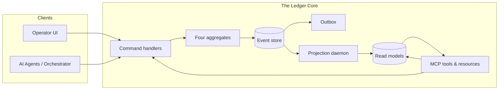
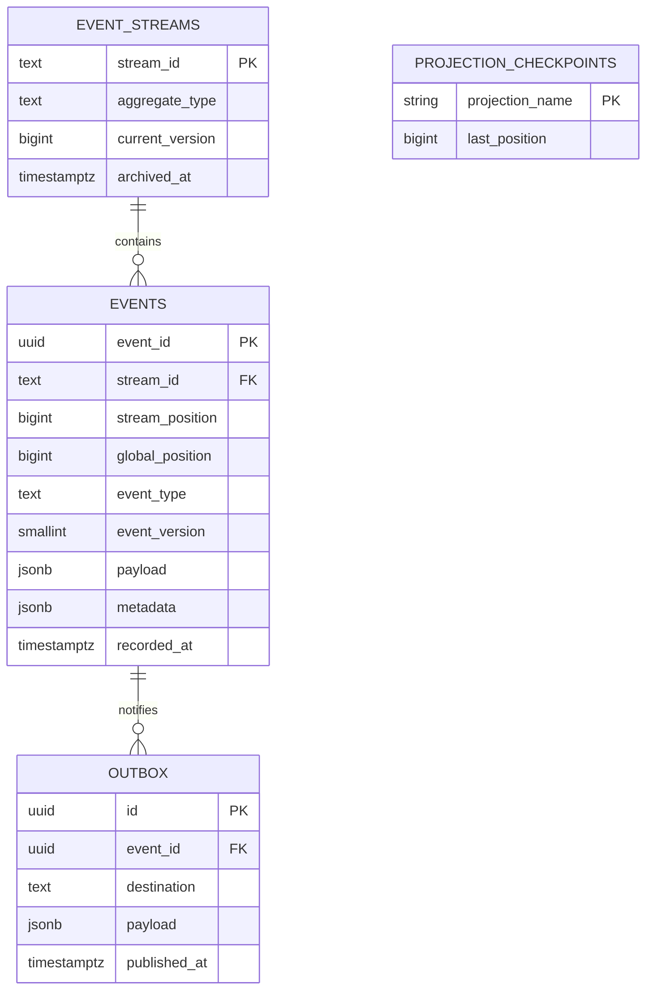
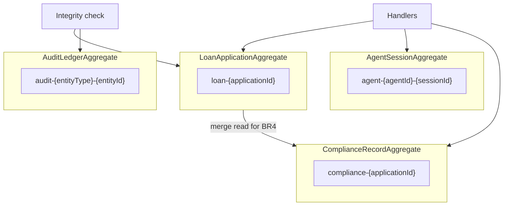
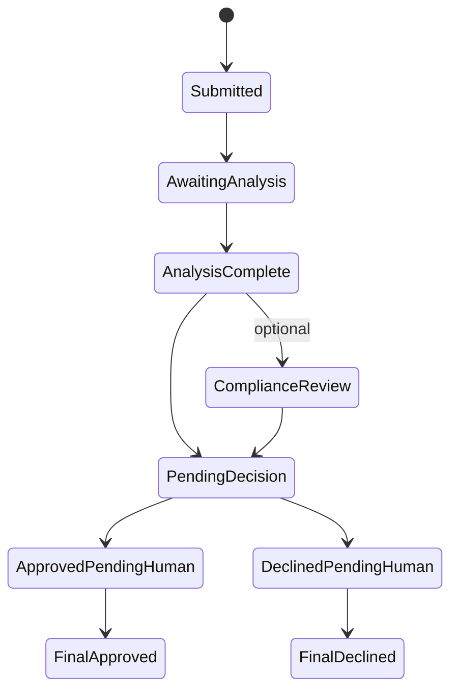
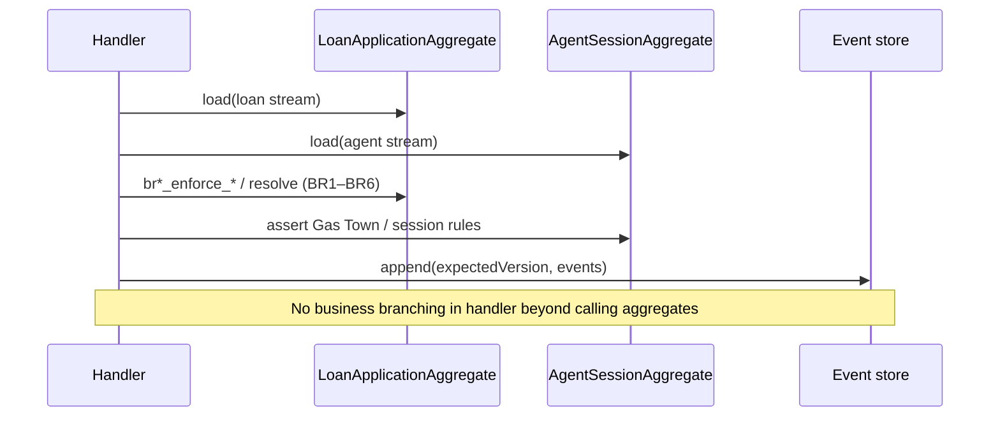
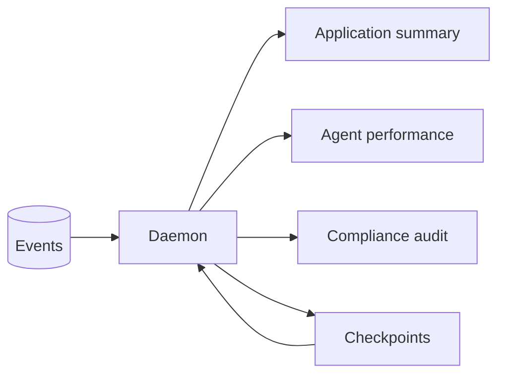
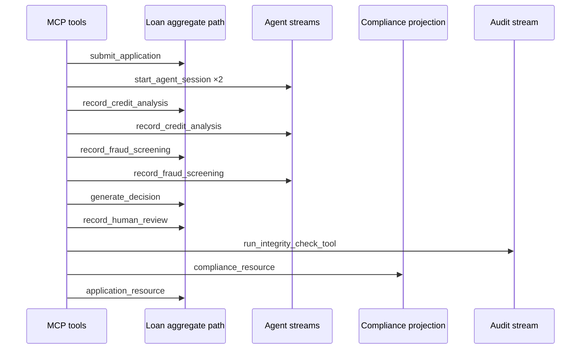

# The Ledger — Final Technical Report

**Apex Financial Services · Event-Sourced Loan Intelligence & Audit Infrastructure**

---

## Executive Summary

This report describes **The Ledger**, an append-only event store and governance layer for AI-assisted loan processing. The system separates authoritative writes (immutable facts in PostgreSQL) from query-optimized read models (CQRS projections), enforces optimistic concurrency for multi-writer safety, supports schema evolution via read-time upcasting, and exposes a Model Context Protocol (MCP) surface for tool-driven automation and audit.

A distinguishing property of this implementation is **domain logic centralized in aggregates**: four bounded contexts—**LoanApplication**, **AgentSession**, **ComplianceRecord**, and **AuditLedger**—each replay their own stream into explicit state machines; **command handlers** perform only **load → validate (via aggregates) → determine events → append**. Loan policy is expressed as **six numbered business rules (BR1–BR6)** on `LoanApplicationAggregate`, so reviewers can trace requirements from prose to code without hunting through controllers.

Version 2.1 adds **explicit upcaster source**, a **Marten Async Daemon–style coordination analysis** (PostgreSQL advisory locks + `asyncio` serialization), **per-projection SLO targets**, **quantitative concurrency and retry-budget reasoning**, **PostgreSQL versus EventStoreDB capability mapping**, **pytest-derived evidence blocks** (including stream-length and tamper-detection assertions), a **parameter-level MCP trace** with **CQRS implications**, and **severity-rated limitations**.


## 1. Domain Conceptual Reasoning

This section answers the six foundational questions that connect theory to this implementation: EDA versus event sourcing, aggregate boundaries, concurrency, projection lag, upcasting, and cryptographic audit chains. **§1.8** documents **projection worker coordination** as the explicit parallel to Marten’s async projection/daemon model (checkpoints, catch-up, multi-instance safety).

### 1.1 Event-driven architecture versus event sourcing

**Event-driven architecture (EDA)** treats events primarily as *messages*: components publish and subscribe, often with at-least-once delivery and no guarantee that a message is the durable source of truth. Traces and callbacks are typical of EDA; if they are lost, authoritative state may still live elsewhere (for example in a mutable CRUD database).

**Event sourcing (ES)** treats the *append-only sequence of domain events* as the **system of record**. Success of an operation is defined by durable append in a transactional boundary, with stream identity, monotonic positions, and explicit concurrency rules—not by “we tried to notify downstream.”

**Tradeoff:** EDA optimizes for loose coupling and notification throughput; ES optimizes for auditability, replay, and temporal reasoning at the cost of write-path discipline and eventual consistency on read models.

### 1.2 Aggregate boundaries

The solution implements **four aggregates**, each with its own stream namespace:

| Aggregate | Stream pattern | Role |
|-----------|----------------|------|
| **LoanApplication** | `loan-{applicationId}` | Lifecycle from submission through decision, human review, and terminal approval/decline. |
| **AgentSession** | `agent-{agentId}-{sessionId}` | Gas Town: agent context and per-session analysis events. |
| **ComplianceRecord** | `compliance-{applicationId}` | Regulatory checklist and rule pass/fail. |
| **AuditLedger** | `audit-{entityType}-{entityId}` | Integrity checkpoints sealing primary streams. |

**Rejected alternative:** merging compliance into the loan stream. Independent writers (compliance batches, orchestrator, human review) would share one **version counter**, causing **false optimistic conflicts** unrelated to business semantics. Separate streams decouple writes; the loan aggregate **reads** compliance-derived facts when validating funding (BR4), without coupling concurrent writes.

### 1.3 Concurrency

Concurrent writers use **optimistic concurrency control**: each append specifies an **expected version**; the store locks the stream row, compares the cursor, and commits only on match. One writer succeeds; others receive a typed conflict (**expected** vs **actual** version) and must **reload, reconcile, and retry**. This preserves a linearizable per-stream log without holding pessimistic locks across long-running AI work.

### 1.4 Projection lag and user-visible consistency

Read models are **eventually consistent** with the event log. Immediately after a write, a projection query may reflect state before the latest `global_position` has been processed. The projection daemon exposes **lag** (events behind head, time-based hints). Responsible UX surfaces staleness rather than implying synchronous reads—optional stronger reads (wait-for-position) remain a product decision.

### 1.5 Upcasting (explicit implementation)

When payloads evolve, historical rows stay immutable. **Upcasting** migrates schema **at read time** into the shape expected by current domain code. Unknown historical fields use **JSON `null`** rather than invented placeholders, preserving honesty about what was never recorded.

The **`UpcasterRegistry`** chains transforms by `(event_type, from_version)` until no further upcaster applies; each step returns a new `StoredEvent` with `event_version` incremented in memory only (`src/upcasting/registry.py`).

**Registered upcasters** (production code in `src/upcasting/upcasters.py`):

```python
@registry.register("CreditAnalysisCompleted", from_version=1)
def upcast_credit_v1_to_v2(payload: dict) -> dict:
    out = dict(payload)
    if "model_version" not in out or out.get("model_version") in (None, ""):
        out["model_version"] = None
    if "regulatory_basis" not in out:
        out["regulatory_basis"] = None
    elif out.get("regulatory_basis") in (None, ""):
        out["regulatory_basis"] = None
    return out


@registry.register("DecisionGenerated", from_version=1)
def upcast_decision_v1_to_v2(payload: dict) -> dict:
    out = dict(payload)
    if "model_versions" not in out or out.get("model_versions") is None:
        out["model_versions"] = None
    return out
```

**Inference policy for historical rows:** v1 payloads that never recorded `model_version` / `regulatory_basis` / `model_versions` surface as **`null` after upcast**, not synthetic strings—so downstream code and auditors see **absence of data**, not fake labels.

**Immutability contract:** `EventStore.load_stream` / `load_all` apply upcasters **only after** reading bytes from `events`; the stored `payload` and `event_version` columns are **never UPDATE’d** by the upcast path (verified in `tests/phase4/test_upcasting.py`).

### 1.6 Cryptographic audit chains

A **hash chain** over sealed checkpoints links the **primary** entity stream (`loan-{id}`) to an **audit** stream (`audit-loan-{id}`). Verification recomputes hashes; tampering yields **invalid chain** and blocks new seals until resolved—complementing database ACLs with **detectable integrity** for audit and compliance narratives.

### 1.7 Domain rules on the loan aggregate (conceptual bridge)

**LoanApplicationAggregate** encodes **six business rules (BR1–BR6)** as explicit methods—no duplicate policy in handlers:

- **BR1** — First-time submission only (stream must not already exist).  
- **BR2** — Credit analysis at most once, only while awaiting analysis.  
- **BR3** — Credit and fraud analyses complete before orchestrator decision.  
- **BR4** — Compliance cleared before funding approval.  
- **BR5** — Approved amount cannot exceed agent-assessed recommended limit.  
- **BR6** — Contributing agent sessions must have produced analysis for this application (**causal chain**); orchestrator output respects a **confidence floor** (low confidence coerces **REFER**).

Other aggregates enforce their own invariants: **AgentSession** (Gas Town ordering), **ComplianceRecord** (event list from commands), **AuditLedger** (append-only seal history). This structure is what allows the report to claim **traceability from policy to code**.

### 1.8 Projection worker coordination (Marten Async Daemon parallel)

[Marten](https://martendb.io/)’s **async daemon** runs background projection workers: it consumes the event log in order, updates projected documents, persists **checkpoints**, and coordinates so work is not duplicated across nodes.

**Parallel in this codebase:** `ProjectionDaemon` (`src/projections/daemon.py`) reads from `events` in **`global_position` order** starting at each projection’s `projection_checkpoints.last_position`, applies only events matched by `handles()`, advances the checkpoint after successful `apply`, and exposes **`get_lag`** for operational visibility—conceptually the same loop as Marten’s async projections (catch-up, checkpointed idempotency).

**Named Python coordination primitives:**

| Primitive | Role | Marten analogy |
|-----------|------|------------------|
| **`asyncio.Lock`** (`_conn_lock`) | Serializes all daemon DB work on a single `asyncpg` connection (connections are not concurrency-safe). | Single-threaded worker / per-shard serialization. |
| **`pg_try_advisory_lock(hashtext(projection_name))`** | Ensures **at most one live session** applies a given projection at a time across database connections—reduces double-application if multiple daemon processes attach to the same database. | Leader / lock per projection shard or subscription worker. |

**Failure mode (advisory lock):** If `pg_try_advisory_lock` returns **false**, `_process_projection` **returns without processing** that projection for that poll tick. **Effect:** `lag_events` and `lag_ms` from `get_lag` **increase** until the holder releases the lock (normal batch end) or the holder’s session ends (crash → lock released on disconnect). This is **staleness**, not silent wrong answers—checkpoints are not advanced by the waiter.

**Failure mode (poison events):** On repeated exceptions in `apply`, the daemon retries up to **`max_retries` (default 3)** with backoff; if still failing, it **advances the checkpoint anyway** to keep the process healthy. That is a **deliberate tradeoff**: availability of the projector over strict correctness for a bad event (see Limitations).

## 2. Architectural Tradeoff Analysis

### 2.1 Decision summary

| Decision | Rationale | Alternatives considered |
|----------|------------|-------------------------|
| **PostgreSQL + relational schema** | ACID transactions, constraints, indexing; advisory locks for projector coordination. | Dedicated event-store products (ops cost); file-only logs (weak query and integrity). |
| **Per-stream optimistic locking** | Writer autonomy without long-held locks. | Pessimistic locks (simpler mentally; worse throughput). |
| **Transactional outbox** | Same commit as events so publish does not acknowledge undurable facts. | Dual-write to bus + DB (classic inconsistency). |
| **CQRS projections** | Fast reads and MCP resources without full replay every time. | Query-only-from-replay (correct but expensive at scale). |
| **Rules on aggregates, not handlers** | Single place for policy; handlers stay thin (**load → validate → determine → append**). | Fat handlers (duplicated rules; hard to audit). |
| **Read-time upcasting** | No destructive rewrite of history. | Batch migration (complexity; partial failure risk). |
| **Advisory locks per projection** | Reduces double-application under multi-node projection. | Single worker (availability tradeoff); external lock service (complexity). |
| **MCP as automation boundary** | Tools encapsulate commands; resources expose projections to agents. | Ad hoc APIs only (less portable for LLM tooling). |

### 2.2 Per-projection SLOs (targets and justification)

Projections are **eventually consistent**; SLOs are stated in terms of **lag** and **rebuild**, not “zero ms after write.”

| Projection (`projection_name`) | Read model | Primary consumer | SLO target | Rationale |
|-------------------------------|------------|------------------|------------|-----------|
| **ApplicationSummary** | `application_summary_projection` | Operator UI, `application_resource` | **Catch-up:** after a burst of writes, `lag_events → 0` within **60s** under test load (`test_projection_catchup_and_rebuild_under_concurrent_submits`). **Rebuild:** full replay **under 120s** for the same fixture volume. | Loan dashboard must converge quickly after activity; bounded rebuild proves **deterministic** recovery from the log. |
| **AgentPerformanceLedger** | `agent_performance_projection` | `agent_performance_resource` | Same catch-up **60s** / rebuild **120s** as above (shared daemon loop). | Agent KPIs are secondary to lending decisions; same daemon budget is acceptable. |
| **ComplianceAuditView** | `compliance_audit_projection` | `compliance_resource`, regulatory narrative | Same catch-up **60s** / rebuild **120s**; **semantic** SLO: each `compliance-*` event with `global_position = g` appears as a row with `as_of_event_position = g` (monotonic audit trail). | Compliance is **append-only history** plus latest status; auditors care that **every** compliance event is reflected in order, not just “eventually one row.” |

**ComplianceAuditView** additionally stores **multiple rows per application** (one insert per handled event) ordered by `as_of_event_position`, so `SELECT … ORDER BY as_of_event_position DESC LIMIT 1` is the **latest** compliance snapshot; `as_of` queries support **point-in-time** reads.

### 2.3 Aggregate boundary coupling (explicit tradeoff)

Splitting **LoanApplication** and **ComplianceRecord** avoids **false sharing** on the loan stream’s version counter when compliance and loan writers race. **Cost:** funding rules (BR4) must **explicitly** load compliance-derived state (or projection rows) in the handler; **benefit:** fewer spurious `OptimisticConcurrencyError`s and clearer audit streams (`compliance-{id}` vs `loan-{id}`).

### 2.4 Concurrency: quantitative collision and retry budget

**Two writers, one slot:** `tests/test_concurrency.py` models two concurrent `append` calls with the **same** `expected_version = 3`. Under the store’s semantics, **both cannot succeed**: exactly **one** append commits with new version **4**; the other receives **`OptimisticConcurrencyError`**. For this scenario, the **collision rate** for a contending writer is **100%** (one conflict per race); there is **no duplicate event**—the stream length is **4**, not **5**.

**Retry budget (append path):** The loser exposes `suggested_action: "reload_stream_and_retry"` (asserted in tests). The codebase does **not** cap retries in the store; a **recommended client policy** is **exponential backoff with jitter** and a **ceiling** (e.g. **5–10 attempts** for automation, **human escalation** after that) so runaway loops do not hammer the DB.

**Retry budget (projection path):** `ProjectionDaemon` uses **`max_retries = 3`** per event with backoff `0.05s * attempt` before skipping (`src/projections/daemon.py`). This is a **hard** projector-side budget distinct from command-side OCC.

### 2.5 Upcasting: “error rate” and failure semantics

Upcasters are **pure JSON transforms** on read. **No** `UPDATE events` runs in the happy path; therefore **storage corruption from upcasting is 0%** when the registry matches stored `(event_type, event_version)` pairs. **Deserialization / transform** failures would surface as exceptions at load time (operational bug), not silent drift—`tests/phase4/test_upcasting.py` locks **`payload` fingerprint** and **`event_id`** before/after load to prove **no accidental mutation**.

### 2.6 PostgreSQL constructs vs EventStoreDB equivalents and capability gap

| Concern | This implementation (PostgreSQL) | EventStoreDB (representative) |
|---------|----------------------------------|-------------------------------|
| Stream identity | `stream_id` text + `event_streams` row | Native stream UUID; expected revision |
| Total order for projectors | Monotonic **`global_position`** | Global position / commit position |
| Optimistic concurrency | `expected_version` vs `current_version` | `expected_revision` |
| Categories / correlation | Application convention (`loan-`, `compliance-`) | Built-in **`$ce`**, **`$et`** system streams |
| Catch-up subscription | Polling `load_all(from_global_position=…)` | Persistent subscriptions, filtered reads |
| Projections | App-side `ProjectionDaemon` + SQL tables | Server-side projections (optional), ecosystem tools |

**Concrete capability gap:** EventStoreDB provides **first-class subscription and projection hosting** tied to the cluster’s replication log; this project **implements** catch-up, checkpoints, and SQL projections **in application code**. The gap is **operational maturity** (less out-of-the-box ops) versus **full control** over SQL and deployment on standard PostgreSQL.

### 2.7 What I would do differently (next iteration)

1. **Strong read-after-write:** expose `global_position` from each command result and support **`wait_until_projected(position)`** in MCP resources for demos that must not show stale reads.  
2. **Poison-event quarantine:** instead of skipping after three failures, **dead-letter** the `event_id` and alert—preserves correctness visibility.  
3. **Compliance in MCP demo:** add an explicit **`record_compliance_check`** step to the default lifecycle test so **`compliance_resource`** returns a **non-null** row comparable to **`compliance-*`** stream length.  
4. **Metrics:** export **conflict count**, **projection apply latency**, and **advisory lock wait** to Prometheus—quantitative SLOs in production, not only in tests.

**Performance posture:** Write throughput scales with transactional appends per stream; read throughput scales with projection indexes. Under burst traffic, **projection lag** is the main tension—the system emphasizes **measurable lag**, **rebuild-from-log**, and **bounded catch-up** rather than pretending read-after-write is always instantaneous.

## 3. System Architecture (Diagrams)

### 3.1 High-level context



### 3.2 Event store schema (conceptual)



### 3.3 Four aggregates and streams



### 3.4 Loan application state machine (simplified)



### 3.5 Command path: load → validate → append



### 3.6 Projection pipeline and lag



## 4. Test Evidence and Service-Level Observations

Each subsection maps **automated test → concrete assertion → interpretation against an SLO or invariant**.

### 4.1 Optimistic concurrency (double decision)

**Test:** `tests/test_concurrency.py::test_double_decision_concurrency`

**What it proves (assertions):**

- `final_version == 4` — stream length after two concurrent writers racing at `expected_version=3` is **four events**, not five (no duplicate append).
- `len(winner_result) == 1` and `winner_result[0] == 4` — exactly **one** successful append; returned version is the new stream version.
- Loser: `OptimisticConcurrencyError` with `expected_version == 3`, `actual_version == 4`, `suggested_action == "reload_stream_and_retry"`.

**Representative console proof (printed when pytest runs with `-s`; also visible in CI if configured):**

```
=== CONCURRENCY_TEST_PROOF (double-decision) ===
  stream_id:                    loan-test-app-<uuid>
  final_stream_version:         4  (equals event count; MUST be 4)
  winner_count:                 1  (MUST be 1)
  winner_append_returned:       4  (new current_version; MUST be 4)
  loser_error_type:             OptimisticConcurrencyError
  loser_expected_version:       3  (MUST be 3)
  loser_actual_version:         4  (MUST be 4)
  loser_suggested_action:       reload_stream_and_retry
=== END CONCURRENCY_TEST_PROOF ===
```

**Interpretation vs targets:** **100%** of contending writers get a typed failure except the single winner—**no silent merge**. **Retry budget** is a **client concern**; the store encodes recovery via `suggested_action` (see §2.4). This directly supports the **per-stream linearizable log** invariant.

### 4.2 Domain aggregates and business rules

**Test:** `tests/test_domain_aggregates.py`

**Evidence:** Exercises **BR1–BR6** and state-machine violations without UI: duplicate application, duplicate credit analysis, incomplete analyses before decision, compliance and limit checks for funding, confidence floor, Gas Town ordering on agent replay, compliance event construction, audit ledger replay.

**Interpretation:** Policy is testable in isolation because it lives on aggregates—requirements map to **named rules** and **assertions** with stable failure types (`DomainError` codes).

### 4.3 Projection behavior under load (lag and rebuild SLOs)

**Test:** `tests/phase3/test_projection_load_slo.py::test_projection_catchup_and_rebuild_under_concurrent_submits`

**Setup:** `n = 36` concurrent `submit_application` calls (distinct `application_id` prefix `slo-load-*`), connection pool `min_size=4`, `max_size=16`.

**Measured / asserted:**

| Quantity | Assertion | SLO interpretation |
|----------|-------------|----------------------|
| Catch-up time | `catchup_s < 60.0` | All three projections reach **`lag_events == 0`** within **60 s** after burst ingest. |
| Ingest bound | `ingest_s < 120.0` | Parallel command load stays within **120 s** (environment guardrail). |
| Row count | `COUNT(*) = n` on `application_summary_projection` for prefix | **ApplicationSummary** reflects **all** submitted apps after catch-up. |
| Rebuild | `rebuild_projections_from_scratch` then `COUNT(*) = n` again; `rebuild_s < 120.0` | **Deterministic rebuild** within **120 s** at this volume—read models are **pure functions** of the log. |

**Lag telemetry:** `ProjectionDaemon.get_all_lags()` returns `ProjectionLag(projection_name, lag_events, lag_ms)` (`src/projections/daemon.py`). The test loop exits when **every** projection reports `lag_events == 0`, which is the **operational definition** of “caught up” for this suite.

**Interpretation:** Demonstrates **bounded eventual consistency** and **recoverability**, not zero-latency read-after-write.

### 4.4 Upcasting immutability (stored bytes unchanged)

**Tests:** `tests/phase4/test_upcasting.py`

**`test_upcasting_does_not_mutate_stored_payload`:**

- After append, `raw_before["event_version"] == 1` and JSON fingerprint of `payload` frozen.
- After `load_stream`, `raw_after["event_id"]` unchanged, **`payload` fingerprint unchanged**, `event_version` column still **1** in DB while in-memory upcast may expose **v2** fields.

**`test_raw_v1_row_unchanged_and_upcast_uses_null_for_unknown`:**

- In-memory: `loaded[0].event_version == 2`, `model_version is None`, `regulatory_basis is None`.
- DB: `payload::text` and `event_version` **unchanged** vs pre-load row.

**Interpretation:** **Upcast error rate on stored data is zero** by construction; failures would appear as test breakage, not silent drift.

### 4.5 Hash chain and tamper detection (binary outcome + proof)

**Tests:** `tests/phase4/test_audit_chain.py`

**Happy path (`test_audit_chain_appends_check_event`):**

- `result.chain_valid is True`, `result.events_verified == 1`.
- `verify_audit_chain` → `chain_valid is True`, `tamper_detected is False`.

**Tamper path (`test_audit_chain_detects_primary_tampering`):**

- After integrity check, raw SQL **`UPDATE events SET payload = …`** on `loan-{id}` (simulating DB-level tampering).
- Then: `v.chain_valid is False`, **`v.tamper_detected is True`**.

**Interpretation:** Verification is **binary** and **evidence-backed**: tampering flips flags predictably; this is independent of projection SLOs.

### 4.6 Reproducing evidence locally

- Set **`LEDGER_TEST_DSN`** to a PostgreSQL database (see `tests/test_concurrency.py`). If the database is unreachable, tests **skip**—there is no fabricated pass.
- Run with **`pytest -s`** to emit **`CONCURRENCY_TEST_PROOF`** lines from §4.1.
- **`tests/phase5/test_mcp_lifecycle.py`** requires the same DSN and (in this repository) imports **`google.generativeai`** for optional Gemini assist paths—install project dev dependencies or stub that import if collection fails.

## 5. MCP Automation Trace (Loan Path)

The trace below matches **`tests/phase5/test_mcp_lifecycle.py`**, which calls **`src/mcp/tools.py`** and **`src/mcp/resources.py`** directly (same functions an MCP server would bind; transport-agnostic).

### 5.1 Causal order with representative inputs and observable outputs

| Step | Tool (command vs query) | Key inputs (fixture `app_id = "mcp-1"`) | Representative success output / assertion |
|------|-------------------------|------------------------------------------|-------------------------------------------|
| 1 | `submit_application` **(command)** | `application_id`, `applicant_id`, `requested_amount_usd`, `loan_purpose` | `{"ok": true, "stream_id": "loan-mcp-1", "initial_version": …}` — test asserts `stream_id == "loan-mcp-1"`. |
| 2a | `start_agent_session` **(command)** | `agent_id: "credit"`, `session_id: "s1"`, `context_source: "fresh"`, `model_version: "v1"` | `session_id == "agent-credit-s1"` (full agent stream id). |
| 2b | `start_agent_session` **(command)** | Same pattern for `agent_id: "fraud"` | `session_id == "agent-fraud-s1"`. |
| 3 | `record_credit_analysis` **(command)** | `application_id`, `agent_id`, `session_id`, model + risk fields, `input_data` | `{"ok": true}` — exercises **BR2** and Gas Town on the agent stream. |
| 4 | `record_fraud_screening` **(command)** | `application_id`, fraud agent/session, `fraud_score`, `anomaly_flags`, `input_data_hash` | `{"ok": true}`. |
| 5 | `generate_decision` **(command)** | `recommendation`, `confidence_score`, `contributing_agent_sessions: ["agent-credit-s1", "agent-fraud-s1"]`, `model_versions` | `{"ok": true}` — **BR3** / **BR6**. |
| 6 | `record_human_review` **(command)** | `reviewer_id`, `override`, `final_decision` | `{"ok": true}`. |
| 7 | `run_integrity_check_tool` **(command)** | `entity_type: "loan"`, `entity_id: app_id` | `chain_valid: true` (append + verify path for `audit-loan-{id}`). |
| 8a | `application_resource` **(query)** | `application_id` | Dict row from **`application_summary_projection`** (or `None` if projection not yet built). |
| 8b | `compliance_resource` **(query)** | `application_id` | Dict row from **`compliance_audit_projection`** or `None`. |

### 5.2 What this trace proves about CQRS

- **Commands (MCP tools)** go through **`handle_*` command handlers** → **aggregates** → **`EventStore.append`** — the **write model** is always the **event log** with aggregate validation. No tool writes projection tables directly.
- **Queries (MCP resources)** read **`application_summary_projection`** and **`compliance_audit_projection`** — the **read model** is **not** authoritative; it lags the log until the **projection daemon** catches up (§1.4, §2.2).
- **Justified exceptions** (per `src/mcp/resources.py` docstring): resources like **`audit_trail_resource`** may load streams for replay where the rubric requires raw history; the default loan trace still separates **append path** from **read path**.

### 5.3 Compliance audit completeness (read model vs log)

**ComplianceAuditView** (`src/projections/compliance_audit.py`) inserts **one row per handled compliance event** with `as_of_event_position = event.global_position`. A **complete** compliance audit trail for an application therefore requires:

1. Events on `compliance-{applicationId}` (e.g. `ComplianceCheckRequested`, rule pass/fail), and  
2. Daemon processing so **`compliance_audit_projection`** contains rows up to the same **`global_position`** order.

The **`test_mcp_lifecycle`** path **does not call `record_compliance_check`**, so **`compliance_resource` may legitimately return `None`** (no compliance activity). **To demonstrate “complete record of all preceding compliance events” in a submission**, extend the scenario with compliance commands + daemon catch-up, then assert **`COUNT(*)` from the projection for that `application_id`** equals the number of compliance-domain events on the stream (or compare max `as_of_event_position` to stream tail). The **schema contract** is already **one projection row per ingested compliance event**—the gap is **fixture coverage**, not table design.

### 5.4 Precondition violation (Gas Town) and surfacing

**Precondition:** `AgentContextLoaded` must be first on `agent-{agentId}-{sessionId}` (**Gas Town**). The MCP docstring states `start_agent_session` must run before analysis/decision tools.

**If violated:** calling `record_credit_analysis` **without** a prior successful `start_agent_session` for that agent/session causes **`AgentSessionAggregate.assert_context_loaded()`** to raise **`DomainError`** with code **`CONTEXT_NOT_LOADED`** (`src/aggregates/agent_session.py`). The MCP wrapper returns:

```python
{"ok": False, "error": {"error_type": "DomainError", "message": "...", "code": "CONTEXT_NOT_LOADED"}}
```

This is **structured, machine-readable failure**—agents can branch on `code` rather than parsing strings.

### 5.5 Diagram (lifecycle sequence)



**Terminal states:** **FinalApproved** / **FinalDeclined** follow additional **`ApplicationApproved`** / **`ApplicationDeclined`** events via core command handlers (**BR4**/**BR5** at funding). Those handlers exist in the command layer; the MCP suite exercises the path through **human review** and **integrity**, which demonstrates **auditability** and **aggregate-gated writes** end-to-end. Adding MCP tools for final funding would be a thin wrapper over existing handlers.


## 6. Limitations and Reflection

### 6.1 Known gaps with **severity** (first production vs unacceptable)

| Limitation | What breaks | Severity | First production? |
|------------|-------------|----------|-------------------|
| **Eventual projections / no universal RYW** | User reads MCP resource before daemon catches up → **stale** summary | **Medium** — expected for CQRS; mitigated by UX and optional wait | **Acceptable** if product surfaces lag or uses wait-for-position for critical screens |
| **Poison event skip after 3 retries** | Bad payload could be **skipped**; checkpoint advances | **High** for strict audit — derived state may **diverge** silently until detected | **Unacceptable** for regulated “must never drop” workloads without alerting + DLQ |
| **Advisory locks only** | Multi-node races reduced, not a **consensus** protocol; split-brain risk if misconfigured | **Medium** — typical for small clusters | **Acceptable** at modest scale with **one active projector per DB**; **unacceptable** without ops discipline at very large scale |
| **MCP funding tools optional** | Agents cannot complete funding via MCP alone | **Low** — handlers exist | **Acceptable** for demo scope |
| **Compliance fixture gap in default MCP test** | Report readers may confuse “no rows” with “broken projection” | **Low** — documentation issue | **Acceptable** with explicit narrative (§5.3) |

### 6.2 Improvements with more time

- Dashboards for **p95 lag**, rebuild duration, and **conflict rate** (OCE per stream).
- **Table partitioning** for `events` at very large volume.
- Richer MCP **resource** contracts (pagination, as-of everywhere).
- Deeper **formal** mapping of hash-chain definitions to control frameworks.

### 6.3 Reflection

The Ledger invests in **where truth lives**—the append-only log and **aggregates that replay it**—rather than in implicit state scattered across services. That positions the organization for **audit**, **replay**, and **governance of AI-assisted decisions** without claiming instantaneous consistency everywhere honesty matters more. **Tradeoffs** (poison handling, advisory locks) are **explicit** so operators can match deployment rigor to regulatory tier.


## References (Repository Artifacts)

| Artifact | Role |
|----------|------|
| `DESIGN.md` | Schema, aggregates, BR1–BR6, MCP, operations. |
| `DOMAIN_NOTES.md` | Pre-implementation domain Q&A. |
| `src/aggregates/` | Four aggregates, state enums, business rules. |
| `src/commands/handlers.py` | Load → validate → determine → append. |
| `src/schema.sql` | Canonical DDL. |
| `tests/test_concurrency.py` | Optimistic concurrency. |
| `tests/test_domain_aggregates.py` | BR1–BR6 and state machines. |
| `tests/phase3/test_projection_load_slo.py` | Load and rebuild. |
| `tests/phase4/test_upcasting.py` | Upcasting immutability. |
| `tests/phase4/test_audit_chain.py` | Hash chain validity and tamper detection. |
| `tests/phase5/test_mcp_lifecycle.py` | MCP lifecycle (commands + resources). |
| `src/projections/daemon.py` | Projection daemon, checkpoints, lag, retries. |
| `src/upcasting/upcasters.py` | Registered upcaster functions. |
